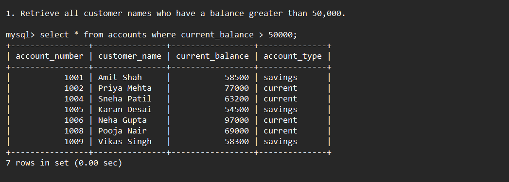
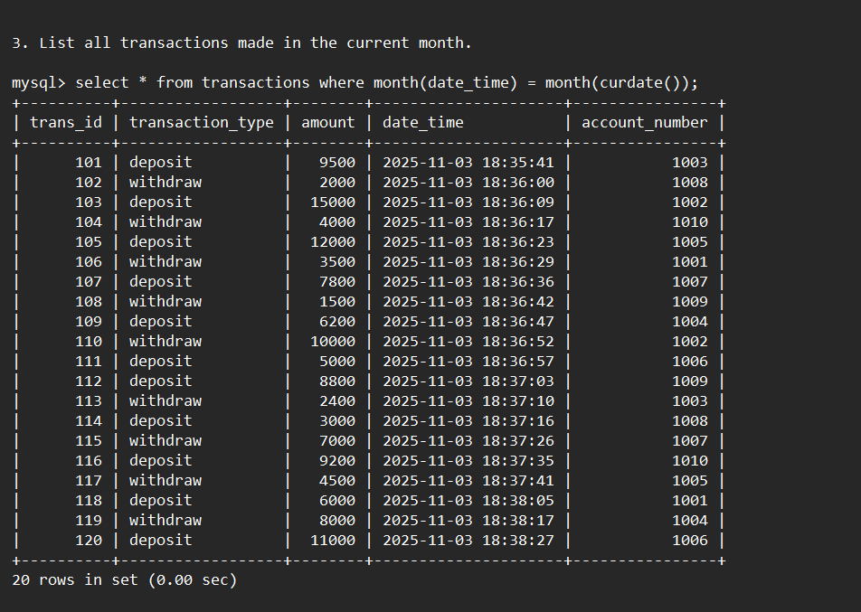
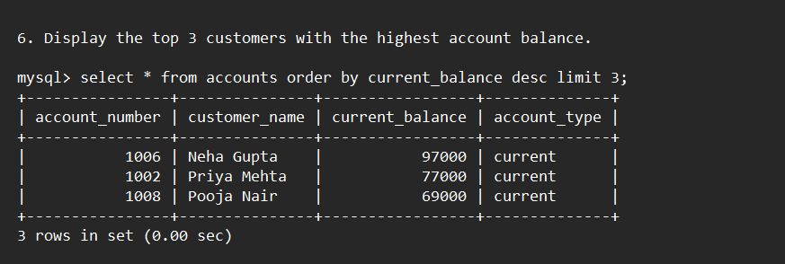
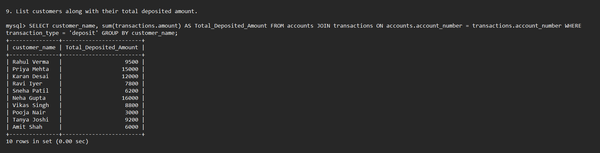

# Banking System Database

The **Banking System Database** is designed to efficiently manage customer accounts and transactions in a simplified banking environment. It demonstrates essential database operations such as deposits, withdrawals, and balance inquiries using MySQL. This project provides a foundational understanding of how banking systems handle and record financial data.

---

## Project Overview

The Banking System Database consists of two main tables — **Accounts** and **Transactions** — that work together to simulate real-world banking operations.  
Every deposit or withdrawal is recorded as a transaction, and the account balance is updated manually using SQL queries (without triggers).  

This structure provides a clear and educational approach to understanding relational databases and their interconnections in financial systems.

---

## Key Objectives

### Account Management  
Store and manage customer details, account types, and current balances.

### Transaction Management  
Record deposits and withdrawals with transaction IDs, timestamps, and corresponding account numbers.

### Data Analysis & Reporting  
Execute SQL queries to retrieve insights such as total balances, top customers, transaction histories, and account summaries.

### Educational Focus  
Demonstrate fundamental SQL concepts including **JOINs**, **GROUP BY**, **aggregate functions**, and **subqueries**.

---

## Tools & Technologies Used
 &nbsp;

- **MySQL** – Database Management System  
- **SQL** – Query Language for data manipulation  

---

## Database Design

### **1. Accounts Table**
| Column | Type | Description |
|--------|------|-------------|
| account_number | INT | Primary Key |
| customer_name | VARCHAR(100) | Customer’s full name |
| current_balance | DECIMAL(10,2) | Current balance in account |
| account_type | VARCHAR(20) | Either ‘savings’ or ‘current’ |

### **2. Transactions Table**
| Column | Type | Description |
|--------|------|-------------|
| trans_id | INT | Primary Key |
| transaction_type | VARCHAR(20) | Deposit or Withdraw |
| amount | DECIMAL(10,2) | Transaction amount |
| date_time | DATETIME | Date and time of transaction |
| account_number | INT (FK) | References `accounts(account_number)` |

---

## Project Results  
[Click here to get full code](https://github.com/SarthakJadhav76/Banking_System_Database/blob/main/banking_database_code.sql)

---

## SQL Query Tasks

### Q1. Retrieve all customer names who have a balance greater than 50,000

Query:
mysql> select * from accounts where current_balance > 50000;

 &nbsp;

---

### Q2. Display all customers having **SAVINGS** accounts

Query:
mysql> select account_number, customer_name, account_type from accounts where account_type = 'savings';

 &nbsp;

---

### Q3. List all transactions made in the current month

Query:
mysql> select * from transactions where month(date_time) = month(curdate());

 &nbsp;

---

### Q4. Show customers who have not made any transactions yet
 &nbsp;

Query:
mysql> select * from accounts where account_number not in (select distinct account_number from transactions);

---

### Q5. Customers who have not made any **withdrawal** transactions

Query:
mysql> select * from accounts where account_number not in (select distinct account_number from transactions where transaction_type = 'withdraw');

 &nbsp;

---

### Q6. Display the **top 3 customers** with the highest account balance

Query:
mysql> select * from accounts order by current_balance desc limit 3;

 &nbsp;

---

### Q7. Retrieve all transactions where the amount is greater than 10,000

Query:
mysql> select * from transactions where amount > 10000;

 &nbsp;

---

### Q8. Show the **total combined balance** of all accounts

Query:
mysql> select sum(current_balance) as Total_Combined_Balance from accounts;

 &nbsp;

---

### Q9. List customers along with their **total deposited amount**

Query:
mysql> SELECT customer_name, sum(transactions.amount) AS Total_Deposited_Amount FROM accounts JOIN transactions ON accounts.account_number = transactions.account_number WHERE transaction_type = 'deposit' GROUP BY customer_name;

 &nbsp;

---

### Q10. Find customers who made a **withdrawal of more than 5,000**

Query:
mysql> SELECT accounts.account_number, customer_name, account_type, trans_id, transaction_type, amount FROM accounts INNER JOIN transactions ON accounts.account_number = transactions.account_number WHERE transaction_type = 'withdraw' and amount > 5000;

 &nbsp;

---

### Q11. Display the **most recent transaction date** for each account

Query 1:
mysql> select account_number, max(date_time) as Recent_Transaction_Date from transactions group by account_number 
order by Recent_Transaction_Date desc;

Query 2:
mysql> select transactions.account_number, customer_name, max(date_time) as Recent_Transaction_Date from transactions join accounts 
on transactions.account_number = accounts.account_number group by account_number order by Recent_Transaction_Date desc;

 &nbsp;

---

### Q12. Retrieve the **number of transactions** each customer has made

Query:
mysql> select distinct accounts.account_number, customer_name, count(transactions.account_number) as Number_Of_Transactions 
from transactions join accounts on transactions.account_number = accounts.account_number group by accounts.account_number, customer_name;

 &nbsp;

---

### Q13. List customers who have both **SAVINGS** and **CURRENT** accounts

Query:
mysql> select * from accounts where account_type = 'savings' and account_type = 'current';

&nbsp;

---

### Q14. Find accounts created by customers whose name starts with ‘P’

Query:
mysql> select * from accounts where customer_name like 'P%';

&nbsp;

---

### Q15. Retrieve customers sorted by their account balance (descending order)

Query:
mysql> select * from accounts order by current_balance desc;

 &nbsp;

---

### Q16. Display the **average account balance per account type**

Query:
mysql> select distinct account_type as Type_Of_Account, avg(current_balance) as Average_Account_Balance from accounts group by account_type;

 &nbsp;

---

## Working of the System

- Deposits and withdrawals are recorded in the **Transactions** table.  
- Balances are updated manually through SQL queries (no triggers used).  
- Each record maintains timestamped transaction history for accurate tracking.  

---

## Advantages
- Simple and beginner-friendly structure.  
- Demonstrates clear understanding of SQL operations.  
- Easy to extend for advanced functionality.  

---

## Limitations
- Manual updates can lead to inconsistencies.  
- Not ideal for large-scale or real-time banking systems.  

---

## Future Scope
- Add triggers for automatic balance updates.  
- Introduce online fund transfer between accounts.  
- Implement user login and role-based access control.  
- Develop a web-based front end for better user interaction.  

---

## Conclusion
This project represents a practical approach to learning and implementing fundamental database management concepts using MySQL.  
It demonstrates how banking transactions can be tracked, analyzed, and reported effectively through structured data handling.
